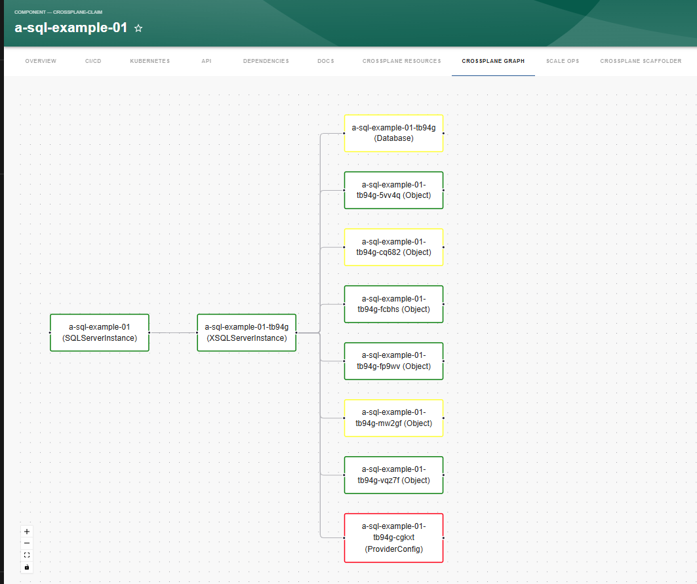
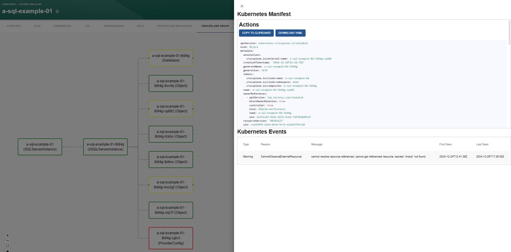
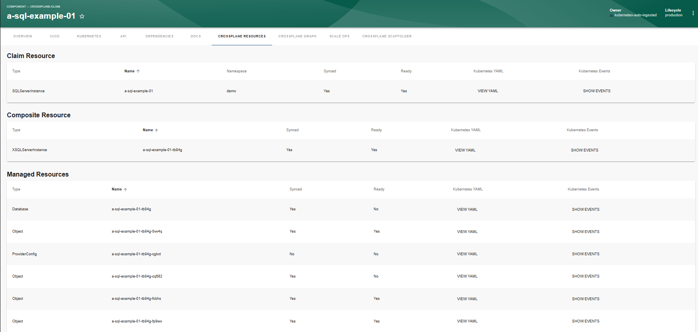
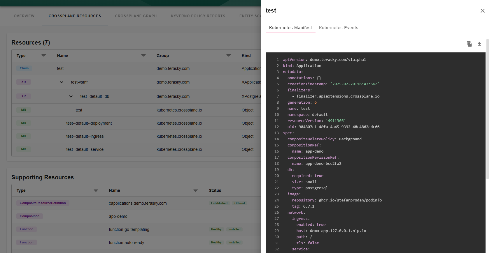
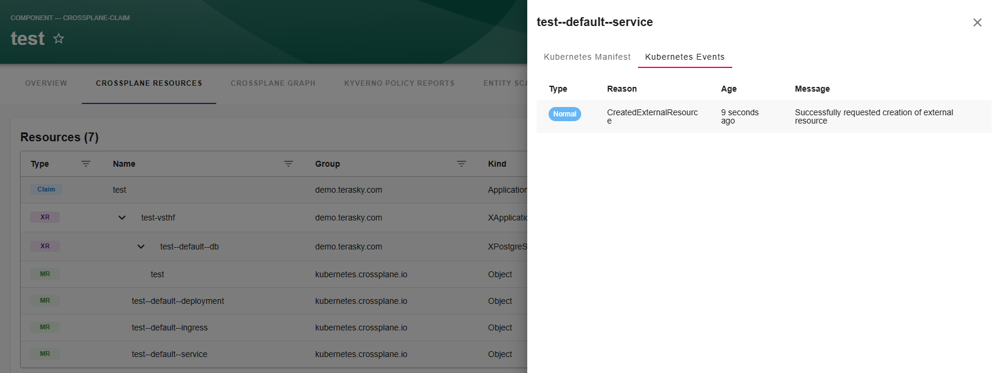
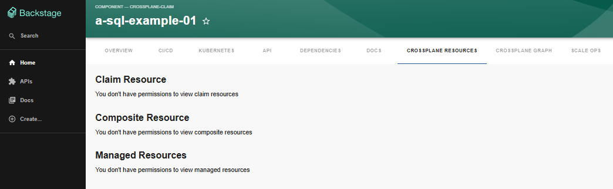
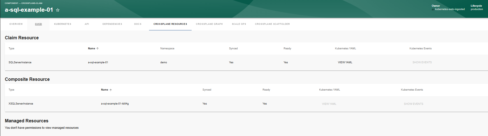
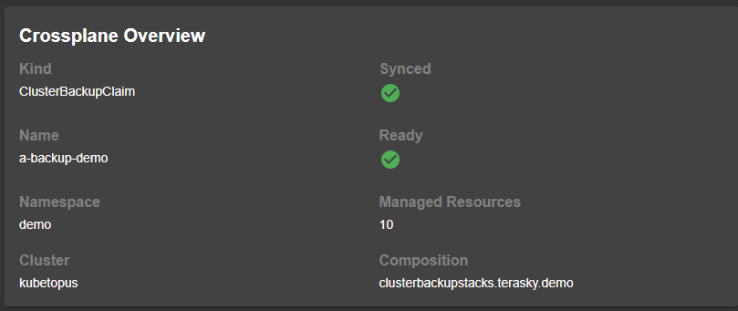

# crossplane-resources

Welcome to the crossplane-resources plugin!

[](https://www.npmjs.com/package/@terasky/backstage-plugin-crossplane-resources-frontend)

## Description

The `crossplane-resources` frontend plugin for Backstage provides visibility into the Crossplane claim, composite resource, and managed resources associated with a component. This relies heavily on system-generated annotations from the Kubernetes Ingestor but technically does not require it if you add all the needed annotations manually. The plugin exposes general data, provides a YAML viewer for each resource including the ability to copy to clipboard the content or download the YAML file. It also supports viewing the events related to a specific resource. It also includes a graph view of the resources related to a claim.

## Installation
First you should install the relevant backend plugin called Kubernetes Ingestor, and configure it based on the [docs here](../kubernetes-ingestor/README.md).

If you want to enable the permission framework for this plugin, you must also install the crossplane-permissions backend plugin based on the [following doc](../crossplane-permissions-backend/README.md)

To install and configure the `crossplane-resources` frontend plugin in your Backstage instance, follow these steps:

  * Add the package
  ```bash
  yarn --cwd packages/app add @terasky/backstage-plugin-crossplane-resources-frontend
  ```
  * Add to Entity Page (packages/app/src/components/catalog/EntityPage.tsx)
  ```javascript
  import { CrossplaneAllResourcesTable, CrossplaneResourceGraph, isCrossplaneAvailable, CrossplaneOverviewCard } from '@terasky/backstage-plugin-crossplane-resources-frontend';

  const crossplaneOverviewContent = (
    <Grid container spacing={3} alignItems="stretch">
      <Grid item md={6}>
        <EntityAboutCard variant="gridItem" />
      </Grid>
      <Grid item md={6}>
        < CrossplaneOverviewCard />
      </Grid>
    </Grid>
  );

  const crossplaneEntityPage = (
    <EntityLayout>
      <EntityLayout.Route path="/" title="Overview">
        {crossplaneOverviewContent}
      </EntityLayout.Route>
      <EntityLayout.Route
        path="/kubernetes"
        title="Kubernetes"
        if={isKubernetesAvailable}
      >
        <EntityKubernetesContent />
      </EntityLayout.Route>
      <EntityLayout.Route if={isCrossplaneAvailable} path="/crossplane-resources" title="Crossplane Resources">
        <CrossplaneAllResourcesTable />
      </EntityLayout.Route>
      <EntityLayout.Route if={isCrossplaneAvailable} path="/crossplane-graph" title="Crossplane Graph">
        <CrossplaneResourceGraph />
      </EntityLayout.Route>
    </EntityLayout>
  );


  const componentPage = (
  <EntitySwitch>
    ...
    <EntitySwitch.Case if={isComponentType('crossplane-claim')}>
      {crossplaneEntityPage}
    </EntitySwitch.Case>
    ...
  );

  ```

## Configuration
* available config options:
```yaml
crossplane:
  enablePermissions: false # Whether to enable permission checks for the crossplane plugin.
```

## Usage
Once installed and configured, the crossplane-resources plugin will provide components for visualizing Crossplane resources in the Backstage UI.
You can add a graph view:


Also a table view is available




If you have integrated the permissions elements, the UI will render accordingly



There is also an overview card which shows basic information:

## Contributing
Contributions are welcome! Please open an issue or submit a pull request on GitHub.

## License
This project is licensed under the Apache-2.0 License.