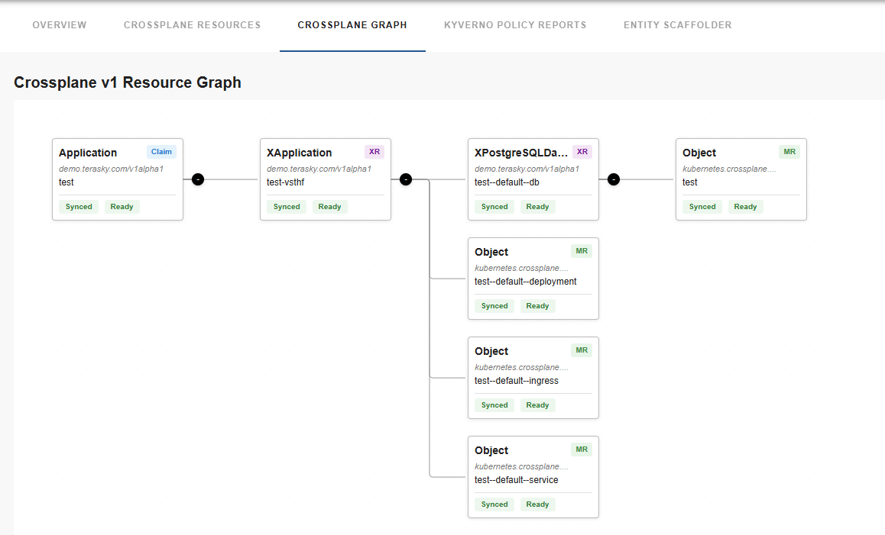
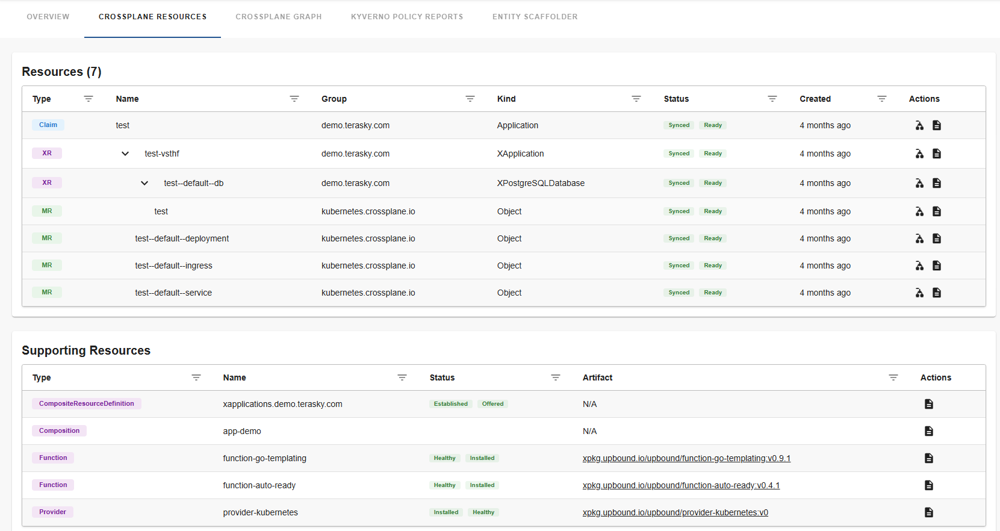

# crossplane-resources

Welcome to the crossplane-resources plugin!

[](https://www.npmjs.com/package/@terasky/backstage-plugin-crossplane-resources-frontend)

## Description

The `crossplane-resources` frontend plugin for Backstage provides visibility into the Crossplane claim, composite resource, and managed resources associated with a component. This relies heavily on system-generated annotations from the Kubernetes Ingestor but technically does not require it if you add all the needed annotations manually. The plugin exposes general data, provides a YAML viewer for each resource including the ability to copy to clipboard the content or download the YAML file. It also supports viewing the events related to a specific resource. It also includes a graph view of the resources related to a claim (v1) or XR (v2).

## Installation
First you should install the relevant backend plugin called Kubernetes Ingestor, and configure it based on the [docs here](../kubernetes-ingestor/README.md).

If you want to enable the permission framework for this plugin, you must also install the crossplane-permissions backend plugin based on the [following doc](../crossplane-permissions-backend/README.md)

To install and configure the `crossplane-resources` frontend plugin in your Backstage instance, follow these steps:

1. Add the package
```bash
yarn --cwd packages/app add @terasky/backstage-plugin-crossplane-resources-frontend
```

2. Add to Entity Page (packages/app/src/components/catalog/EntityPage.tsx)
```typescript
import {
  CrossplaneResourcesTableSelector,
  CrossplaneOverviewCardSelector,
  CrossplaneResourceGraphSelector,
  useResourceGraphAvailable,
  useResourcesListAvailable,
  IfCrossplaneOverviewAvailable,
  IfCrossplaneResourceGraphAvailable,
  IfCrossplaneResourcesListAvailable,
} from '@terasky/backstage-plugin-crossplane-resources-frontend';

const crossplaneOverviewContent = (
  <Grid container spacing={3} alignItems="stretch">
    <Grid item md={6}>
      <EntityAboutCard variant="gridItem" />
    </Grid>
    <IfCrossplaneOverviewAvailable>
      <Grid item md={6}>
        <CrossplaneOverviewCardSelector />
      </Grid>
    </IfCrossplaneOverviewAvailable>
    <Grid item md={4} xs={12}>
      <EntityLinksCard />
    </Grid>
  </Grid>
);

// Create the Crossplane entity page component with permission checks
const CrossplaneEntityPage = () => {
  const isResourcesListAvailable = useResourcesListAvailable();
  const isResourceGraphAvailable = useResourceGraphAvailable();

  return (
    <EntityLayout>
      <EntityLayout.Route path="/" title="Overview">
        {crossplaneOverviewContent}
      </EntityLayout.Route>

      <EntityLayout.Route if={isResourcesListAvailable} path="/crossplane-resources" title="Crossplane Resources">
        <IfCrossplaneResourcesListAvailable>
          <CrossplaneResourcesTableSelector />
        </IfCrossplaneResourcesListAvailable>
      </EntityLayout.Route>

      <EntityLayout.Route if={isResourceGraphAvailable} path="/crossplane-graph" title="Crossplane Graph">
        <IfCrossplaneResourceGraphAvailable>
          <CrossplaneResourceGraphSelector />
        </IfCrossplaneResourceGraphAvailable>
      </EntityLayout.Route>

    </EntityLayout>
  );
};

// Use the component in your entity switch
const componentPage = (
  <EntitySwitch>
    {/* ... other cases ... */}
    <EntitySwitch.Case if={isComponentType('crossplane-claim')}>
      <CrossplaneEntityPage />
    </EntitySwitch.Case>
    <EntitySwitch.Case if={isComponentType('crossplane-xr')}>
      <CrossplaneEntityPage />
    </EntitySwitch.Case>
  </EntitySwitch>
);
```

## Configuration
Available config options:
```yaml
crossplane:
  enablePermissions: false # Whether to enable permission checks for the crossplane plugin.
```

## Permission Framework Integration
The plugin provides several permission-related components and hooks to control access to different features:

1. **Permission Hooks**:
   - `useResourcesListAvailable()`: Controls visibility of the Resources List tab
   - `useResourceGraphAvailable()`: Controls visibility of the Resource Graph tab

2. **Wrapper Components**:
   - `IfCrossplaneOverviewAvailable`: Conditionally renders the overview card
   - `IfCrossplaneResourceGraphAvailable`: Conditionally renders the resource graph
   - `IfCrossplaneResourcesListAvailable`: Conditionally renders the resources list

These components work together to provide granular access control:
- If permissions are disabled (`enablePermissions: false`), all features are available
- If permissions are enabled, each feature checks the user's permissions before rendering
- Tabs are completely hidden if the user doesn't have permission to view them
- Content is protected even if somehow accessed directly

## Usage
Once installed and configured, the crossplane-resources plugin will provide components for visualizing Crossplane resources in the Backstage UI.
You can add a graph view:


Also a table view is available



If you have integrated the permissions elements, the UI will render accordingly


There is also an overview card which shows basic information:


## Contributing
Contributions are welcome! Please open an issue or submit a pull request on GitHub.

## License
This project is licensed under the Apache-2.0 License.