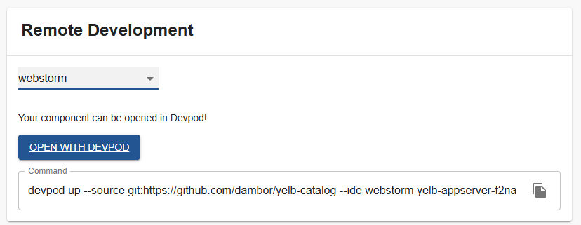
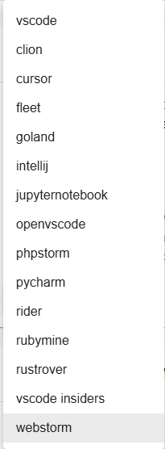

# devpod

Welcome to the devpod plugin!

[](https://www.npmjs.com/package/@terasky/backstage-plugin-devpod)

## Description

The `devpod` plugin for Backstage adds a grid item on the overview tab of components allowing for an "Open in Devpod" button. It supports allowing the user to choose the IDE it should open with and also provides the CLI command the user could run to open it up from the command line.



## Installation

To install and configure the `devpod` plugin in your Backstage instance, follow these steps:

  * Add the package
  ```bash
  yarn --cwd packages/app add @terasky/backstage-plugin-devpod
  ```
  * Add to Entity Page (packages/app/src/components/catalog/EntityPage.tsx)
  ```javascript
  import { DevpodComponent, isDevpodAvailable } from '@terasky/backstage-plugin-devpod';
  
  ...

  const overviewContent = (
  <Grid container spacing={3} alignItems="stretch">
    ...

    <EntitySwitch>
      <EntitySwitch.Case if={isDevpodAvailable}>
        <Grid item md={6}>
          <DevpodComponent />
        </Grid>
      </EntitySwitch.Case>
    </EntitySwitch>

    ...
  </Grid>
  );
  ```

## Configuration
* available config options:
```yaml
devpod:
  defaultIDE: # Default is vscode. supported values are vscode, clion, cursor, fleet, goland, intellij, jupyternotebook, openvscode, phpstorm, pycharm, rider, rubymine, rustrover, vscode-insiders, and webstorm
```

## Usage
Once installed and configured, the devpod plugin will provide components for launching Devpod workspaces directly from the Backstage UI.

## Contributing
Contributions are welcome! Please open an issue or submit a pull request on GitHub.

## License
This project is licensed under the Apache-2.0 License.