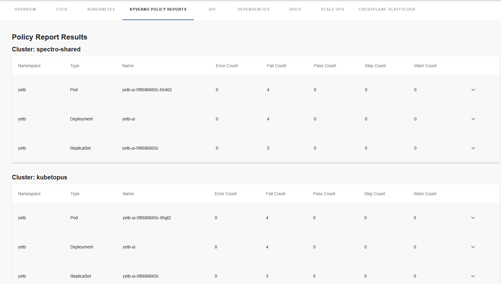
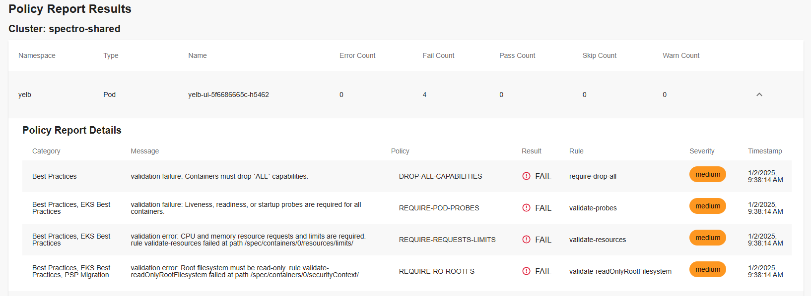
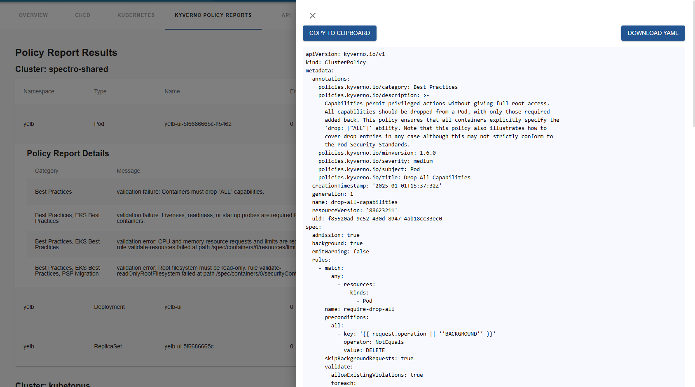

# kyverno-policy-reports

Welcome to the kyverno-policy-reports plugin!

[](https://www.npmjs.com/package/@terasky/backstage-plugin-kyverno-policy-reports-frontend)

## Description

The `kyverno-policy-reports` frontend plugin for Backstage provides visibility into the Kyverno policy reports associated with a component. This plugin allows you to view policy reports, including details such as error counts, fail counts, pass counts, skip counts, and warning counts. It also provides a YAML viewer for each policy, including the ability to copy to clipboard the content or download the YAML file.

## Installation

If you want to enable the permission framework for this plugin, you must also install the kyverno-permissions backend plugin based on the [following doc](../kyverno-permissions-backend/README.md).

To install and configure the `kyverno-policy-reports` frontend plugin in your Backstage instance, follow these steps:

  * Add the package
  ```bash
  yarn --cwd packages/app add @terasky/backstage-plugin-kyverno-policy-reports
  ```
  * Add to Entity Page (packages/app/src/components/catalog/EntityPage.tsx)
  ```javascript
  import { KyvernoPolicyReportsTable } from '@terasky/backstage-plugin-kyverno-policy-reports';
  
  ...

  const serviceEntityPage = (
  <EntityLayout>
    ...
    
    <EntityLayout.Route path="/kyverno-policy-reports" title="Kyverno Policy Reports">
      <KyvernoPolicyReportsTable />
    </EntityLayout.Route>

    ...
  </EntityLayout>
  );
  ```

# Usage
Once installed and configured, the kyverno-policy-reports plugin will provide components for visualizing Kyverno policy reports in the Backstage UI.

You can see i haigh level table per cluster with the resources of this components results:


By clicking on a specific resource row, details will expand bellow:


You can click on the policy name, and get the full YAML of the policy which this result is made by:


# Contributing
Contributions are welcome! Please open an issue or submit a pull request on GitHub.

# License
This project is licensed under the Apache-2.0 License.