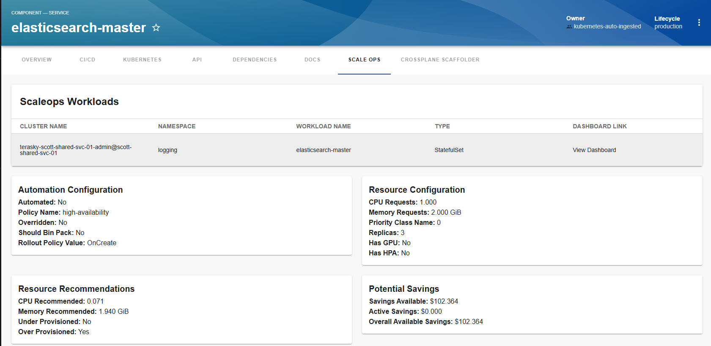
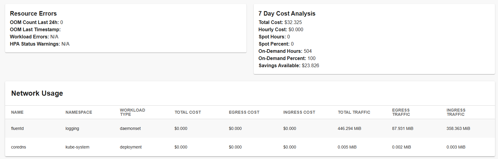

# scaleops-frontend

Welcome to the scaleops-frontend plugin!

[](https://www.npmjs.com/package/@terasky/backstage-plugin-scaleops-frontend)

## Description

The `scaleops-frontend` plugin for Backstage displays data from ScaleOps regarding Kubernetes entities on your component. It shows potential and realized savings and can provide a link to the ScaleOps dashboard for more specific and broader data points. This plugin supports a single ScaleOps endpoint but does support multi-cluster features in ScaleOps allowing for end-to-end visibility.



## Installation

To install and configure the `scaleops-frontend` plugin in your Backstage instance, follow these steps:

* Add the package
  ```bash
  yarn --cwd packages/app add @terasky/backstage-plugin-scaleops-frontend
  ```
  * Add to Entity Page (packages/app/src/components/catalog/EntityPage.tsx)
  ```javascript
  import { ScaleOpsDashboard, isScaleopsAvailable } from '@terasky/backstage-plugin-scaleops-frontend'


  const serviceEntityPage = (
  <EntityLayout>
    ...
    
    <EntityLayout.Route if={isScaleopsAvailable} path="/scaleops" title="ScaleOps">
      <ScaleOpsDashboard />
    </EntityLayout.Route>

    ...
  </EntityLayout>
  );
  ```

## Configuration
* With internal auth setup in scaleops:
```yaml
scaleops:
  baseUrl: url for your scaleops instance
  linkToDashboard: true
  authentication: 
    enabled: true
    user: EXMAPLE_USER
    password: EXAMPLE_PASSWORD

proxy:
  endpoints:
    '/scaleops':
      target: 'URL OF YOUR SCALEOPS INSTANCE'
      changeOrigin: true
      credentials: dangerously-allow-unauthenticated
```
* With no auth setup in scaleops
```yaml
scaleops:
  baseUrl: url for your scaleops instance
  linkToDashboard: true
  authentication: 
    enabled: false

proxy:
  endpoints:
    '/scaleops':
      target: 'URL OF YOUR SCALEOPS INSTANCE'
      changeOrigin: true
      credentials: dangerously-allow-unauthenticated
```
* Other Auth options are planned for future versions

## Usage
Once installed and configured, the scaleops-frontend plugin will provide components for visualizing ScaleOps data in the Backstage UI.


## Contributing
Contributions are welcome! Please open an issue or submit a pull request on GitHub.

## License
This project is licensed under the Apache-2.0 License.
