# vcf-automation

Welcome to the vcf-automation plugin!

[](https://www.npmjs.com/package/@terasky/backstage-plugin-vcf-automation)

## Description

The `vcf-automation` plugin for Backstage provides visibility into VCF deployments, resources, and projects. It offers detailed views of deployment operations, resource states, and project configurations. The plugin integrates with Backstage's permission framework to ensure secure access control.

## Prerequisites

Before installing this plugin, ensure you have:

1. [VCF Automation Backend Plugin](../vcf-automation-backend/README.md) - Required for API integration
2. [VCF Ingestor Plugin](../vcf-ingestor/README.md) - Required for entity synchronization

## Installation

### 1. Install the Plugin

Add the plugin to your Backstage project:

```bash
# From your Backstage root directory
yarn --cwd packages/app add @terasky/backstage-plugin-vcf-automation
```

### 2. Register the Plugin

Add the plugin to your app's APIs in `packages/app/src/apis.ts`:

```typescript
import {
  vcfAutomationApiRef,
  VcfAutomationClient,
} from '@terasky/backstage-plugin-vcf-automation';

export const apis: AnyApiFactory[] = [
  // ... other API factories
  createApiFactory({
    api: vcfAutomationApiRef,
    deps: { discoveryApi: discoveryApiRef, identityApi: identityApiRef },
    factory: ({ discoveryApi, identityApi }) => 
      new VcfAutomationClient({ discoveryApi, identityApi }),
  }),
];
```
### 3. Add to your App.tsx file

```typescript
import { vcfAutomationPlugin } from '@terasky/backstage-plugin-vcf-automation';

const app = createApp({
  apis,
  bindRoutes({ bind }) {
    
    ...

    bind(vcfAutomationPlugin.externalRoutes, {
      catalogIndex: catalogPlugin.routes.catalogIndex,
    });
    
    ...
    
  },

```
### 4. Add Components to Entity Pages

Add the VCF Automation components to your entity pages in `packages/app/src/components/catalog/EntityPage.tsx`:

```typescript
import {
  VCFAutomationDeploymentOverview,
  VCFAutomationDeploymentDetails,
  VCFAutomationVSphereVMOverview,
  VCFAutomationVSphereVMDetails,
  VCFAutomationGenericResourceOverview,
  VCFAutomationGenericResourceDetails,
  VCFAutomationProjectOverview,
  VCFAutomationProjectDetails,
} from '@terasky/backstage-plugin-vcf-automation';
import { Entity } from '@backstage/catalog-model';

// For VSphere VMs
const vcfAutomationVSphereVMPage = (
  <EntityLayout>
    <EntityLayout.Route path="/" title="Overview">
      <Grid container spacing={3} alignItems="stretch">
        <Grid item md={6}>
          <EntityAboutCard variant="gridItem" />
        </Grid>
        <Grid item md={6}>
          <VCFAutomationVSphereVMOverview />
        </Grid>
      </Grid>
    </EntityLayout.Route>
    <EntityLayout.Route path="/vcf-automation" title="VCF Automation">
      <VCFAutomationVSphereVMDetails />
    </EntityLayout.Route>
  </EntityLayout>
);

// Add to your component page switch
const componentPage = (
  <EntitySwitch>
    <EntitySwitch.Case if={isComponentType('Cloud.vSphere.Machine')}>
      {vcfAutomationVSphereVMPage}
    </EntitySwitch.Case>
    // ... other cases
  </EntitySwitch>
);

// For VCF Deployments
const hasVcfAutomationDeploymentStatus = (entity: Entity): boolean => 
  Boolean(entity.metadata?.annotations?.['terasky.backstage.io/vcf-automation-deployment-status']);

const vcfAutomationDeploymentPage = (
  <EntityLayout>
    <EntityLayout.Route path="/" title="Overview">
      <Grid container spacing={3} alignItems="stretch">
        <Grid item md={6}>
          <VCFAutomationDeploymentOverview />
        </Grid>
      </Grid>
    </EntityLayout.Route>
    <EntityLayout.Route path="/vcf-automation" title="VCF Automation">
      <VCFAutomationDeploymentDetails />
    </EntityLayout.Route>
  </EntityLayout>
);

// For Generic Resources
const hasVcfAutomationResourceType = (entity: Entity): boolean => 
  Boolean(entity.metadata?.annotations?.['terasky.backstage.io/vcf-automation-resource-type']);

const vcfAutomationGenericResourcePage = (
  <EntityLayout>
    <EntityLayout.Route path="/" title="Overview">
      <Grid container spacing={3} alignItems="stretch">
        <Grid item md={6}>
          <VCFAutomationGenericResourceOverview />
        </Grid>
      </Grid>
    </EntityLayout.Route>
    <EntityLayout.Route path="/vcf-automation" title="VCF Automation">
      <VCFAutomationGenericResourceDetails />
    </EntityLayout.Route>
  </EntityLayout>
);

// For Projects (in Domain page)
const domainPage = (
  <EntityLayout>
    <EntityLayout.Route path="/" title="Overview">
      <Grid container spacing={3} alignItems="stretch">
        <Grid item md={6}>
          <VCFAutomationProjectOverview />
        </Grid>
      </Grid>
    </EntityLayout.Route>
    <EntityLayout.Route path="/vcf-automation" title="VCF Automation">
      <VCFAutomationProjectDetails />
    </EntityLayout.Route>
  </EntityLayout>
);

// Add a Resources Page
const resourcePage = (
  <EntitySwitch>
    <EntitySwitch.Case if={hasVcfAutomationResourceType}>
      {vcfAutomationGenericResourcePage}
    </EntitySwitch.Case>
    <EntitySwitch.Case>
      {defaultEntityPage}
    </EntitySwitch.Case>
  </EntitySwitch>
);

// Update the entityPage constant to include the resource page
export const entityPage = (
  <EntitySwitch>
    ...
    <EntitySwitch.Case if={isKind('resource')} children={resourcePage} />
    ...
  </EntitySwitch>
);
```

### 5. Configure Backend Integration

Add the following to your `app-config.yaml`:

```yaml
vcfAutomation:
  baseUrl: http://your-vcf-automation-service
```

## Entity Integration

The plugin integrates with different entity types:

### VSphere VM Component
```yaml
apiVersion: backstage.io/v1alpha1
kind: Component
metadata:
  name: my-vm
spec:
  type: Cloud.vSphere.Machine
  system: my-deployment  # References parent deployment
```

### VCF Deployment
```yaml
apiVersion: backstage.io/v1alpha1
kind: System
metadata:
  name: my-deployment
  annotations:
    terasky.backstage.io/vcf-automation-deployment-status: 'true'
```

### Generic Resource
```yaml
apiVersion: backstage.io/v1alpha1
kind: Resource
metadata:
  name: my-resource
  annotations:
    terasky.backstage.io/vcf-automation-resource-type: 'network'
```

### Project (Domain)
```yaml
apiVersion: backstage.io/v1alpha1
kind: Domain
metadata:
  name: my-project
```

## Features

- **VSphere VM Management**: Detailed view of VM configurations and status
- **Deployment Operations**: Track deployment status and history
- **Resource Management**: Monitor various VCF resource types
- **Project Administration**: Manage VCF project settings and resources
- **Permission Integration**: Built-in support for Backstage's permission framework

## Usage

Once installed and configured, the VCF Automation plugin provides comprehensive views for different VCF entity types:

### Project (Domain) Views
The project overview provides a high-level summary of your VCF project:
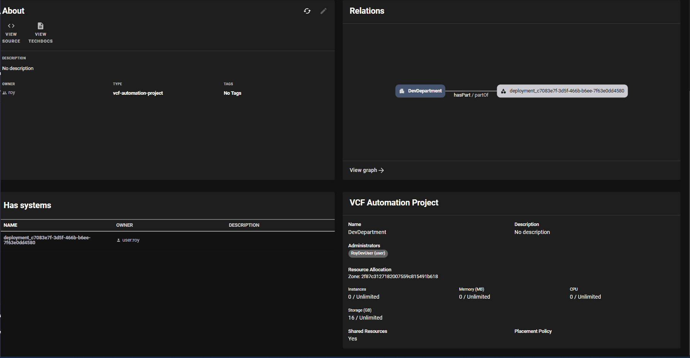

Detailed project information is available as well:
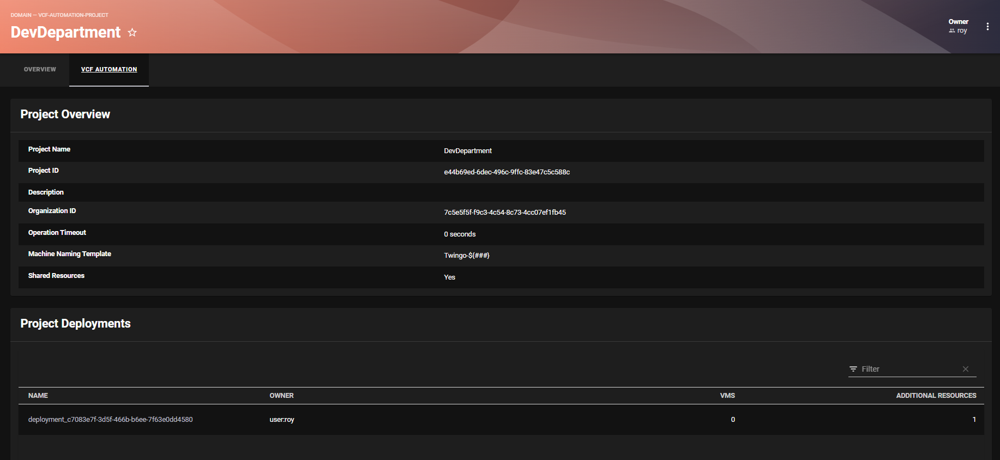
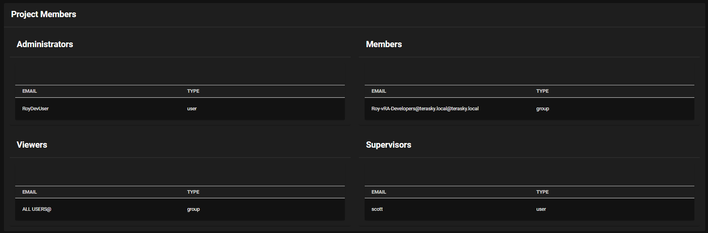
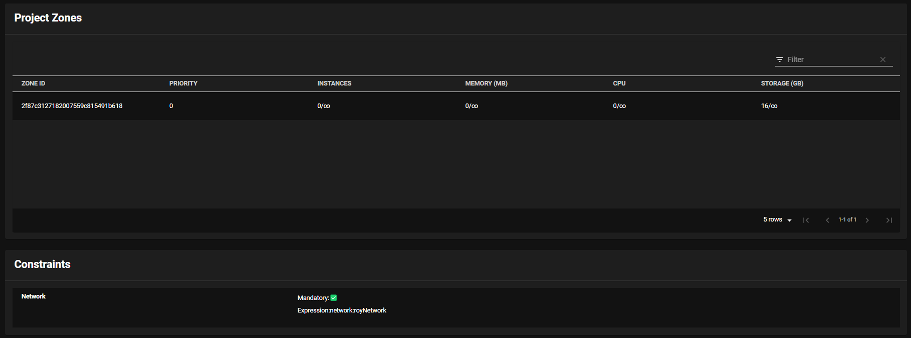

### Deployment Views
Get a quick overview of your VCF deployments:
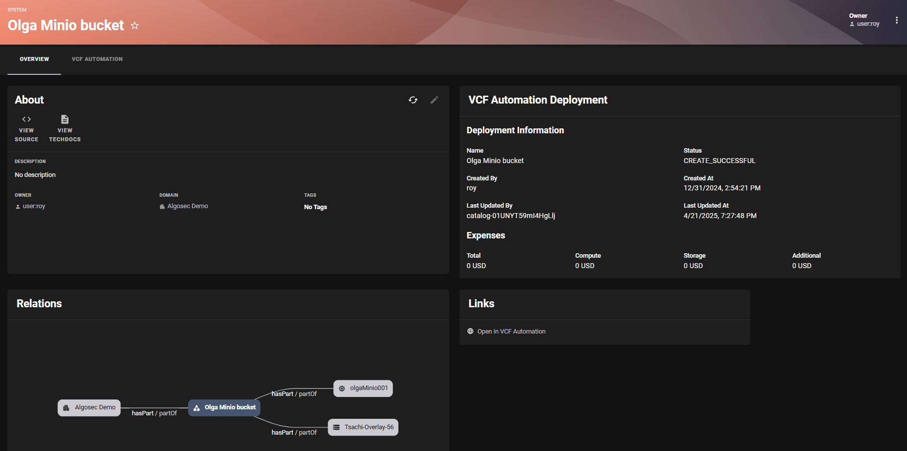

Access detailed deployment information:
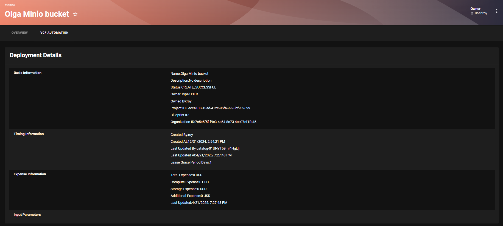
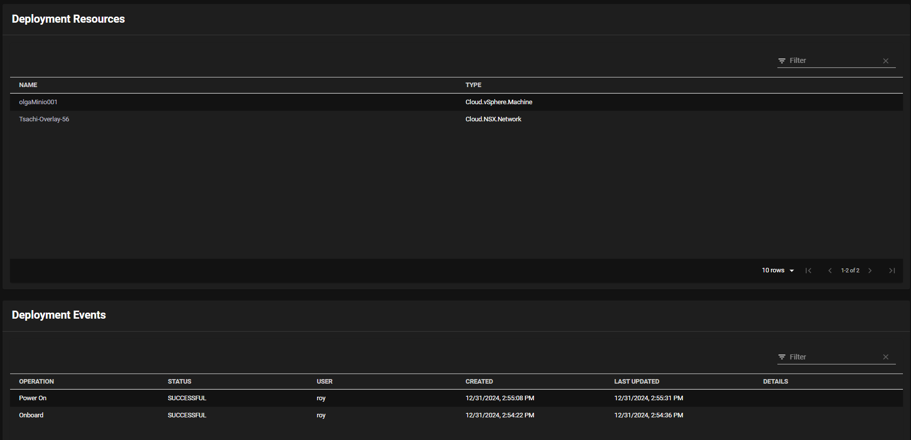

### VSphere VM Views
Monitor your VSphere VMs with the overview card:
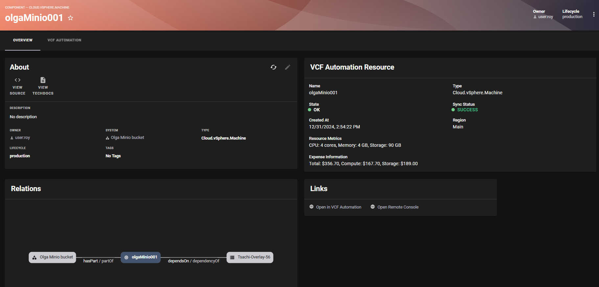

Dive deep into VM configurations and status:
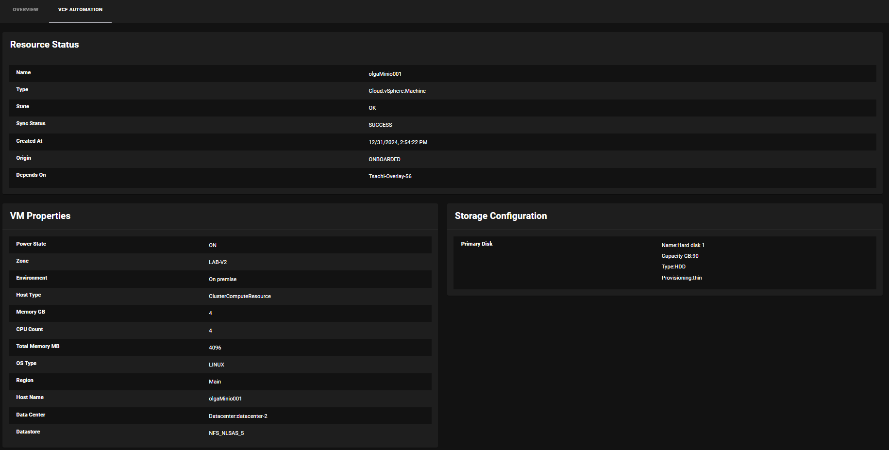
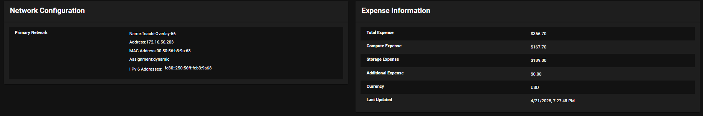

### Generic Resource Views
View resource summaries in the overview:
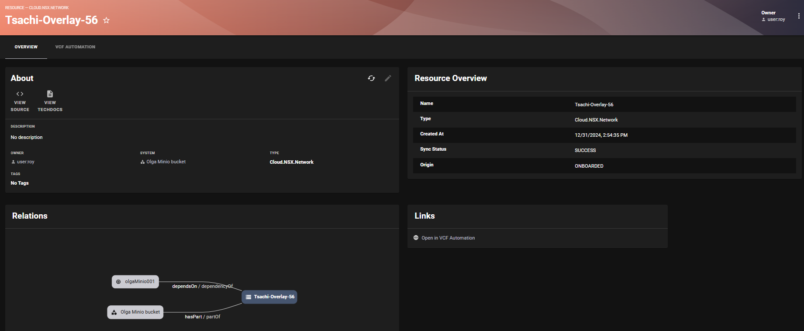

Access detailed resource information:
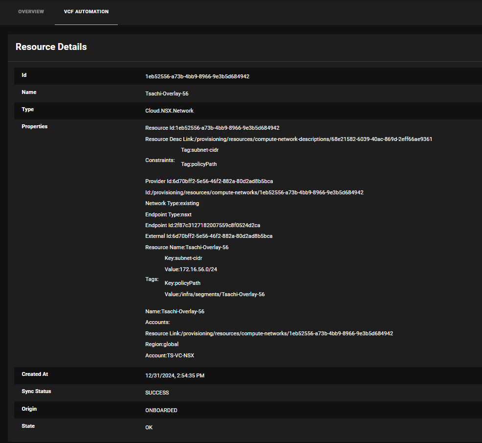

## Contributing

Contributions are welcome! Please open an issue or submit a pull request on GitHub.

## License

This project is licensed under the Apache-2.0 License.
