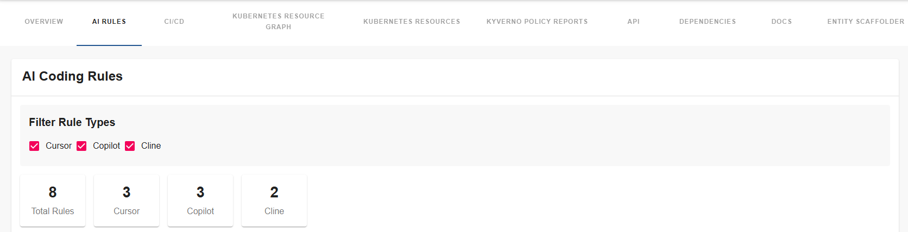
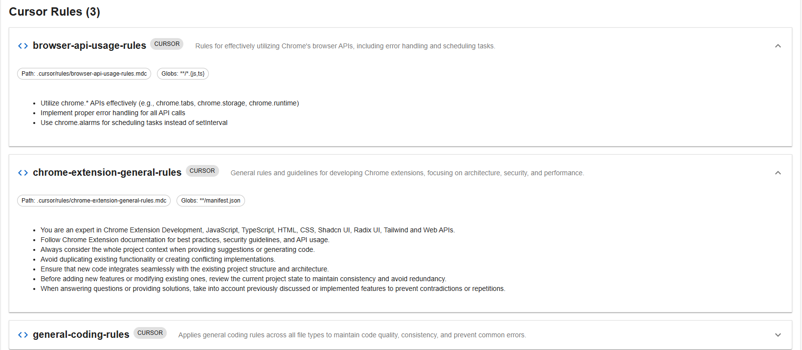
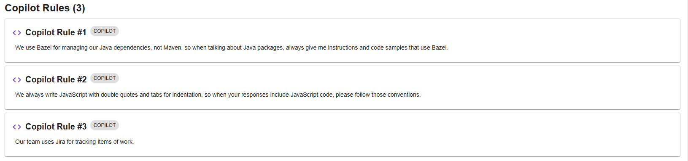
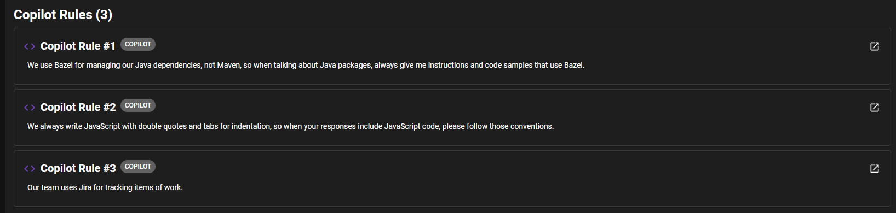

# AI Coding Rules Plugin

The AI Coding Rules plugin for Backstage provides comprehensive visualization of AI coding rules from various sources like Cursor, GitHub Copilot, and Cline. It enables teams to discover, and view their AI coding guidelines directly within the Backstage interface.

## Plugin Components

### Frontend Plugin
The frontend plugin provides a user interface for:

- Visualizing Cursor rules from `.mdc` files in `.cursor/rules/` directories
- Displaying GitHub Copilot rules from `.github/copilot-instructions.md`
- Showing Cline rules from `.clinerules/*.md` files
- Filtering and searching through rule types
- Viewing rule metadata and content in expandable cards
- Statistics and overview of rule counts

[Learn more about the frontend plugin](./frontend/about.md)

### Backend Plugin
The backend plugin handles:

- Integration with Backstage SCM integrations
- Fetching rules from Git repositories
- Parsing frontmatter metadata in rule files
- API endpoints for rule data retrieval
- Support for multiple rule types and formats

[Learn more about the backend plugin](./backend/about.md)

## Features

- **Multi-Source Support**: Support for Cursor, GitHub Copilot, and Cline rules
- **Modern UI**: Clean and intuitive interface with filtering capabilities
- **Rule Discovery**: Automatic detection of rule files in repositories
- **Metadata Parsing**: Extract and display rule metadata from frontmatter
- **Configurable Types**: Configure which rule types to display via Backstage configuration
- **Repository Integration**: Seamless integration with all Backstage SCM integrations

## Screenshots

### AI Rules Overview

*AI Rules component showing rule statistics and filtering options*

*Detailed view of AI coding rules from cursor with expandable cards*

*Detailed view of AI coding rules from copilot project rules*

*Detailed view of AI coding rules from cline with expandable cards*

## Documentation Structure

Frontend Plugin  
- [About](./frontend/about.md)  
- [Installation](./frontend/install.md)  
- [Configuration](./frontend/configure.md)  

Backend Plugin  
- [About](./backend/about.md)  
- [Installation](./backend/install.md)  
- [Configuration](./backend/configure.md)  

## Supported Rule Types

The plugin supports the following AI coding rule sources:

- **Cursor Rules**: `.mdc` files in `.cursor/rules/` directories with frontmatter metadata support
- **GitHub Copilot Rules**: `.github/copilot-instructions.md` files with automatic section splitting
- **Cline Rules**: `.md` files in `.clinerules/` directories with markdown section extraction

## Getting Started

To get started with the AI Coding Rules plugin:

1. Install and configure the backend plugin
2. Set up the frontend components
3. Configure rule types in your app-config.yaml
4. Add the component to entity pages
5. Start discovering and managing AI coding rules

For detailed installation and configuration instructions, refer to the individual plugin documentation linked above. 