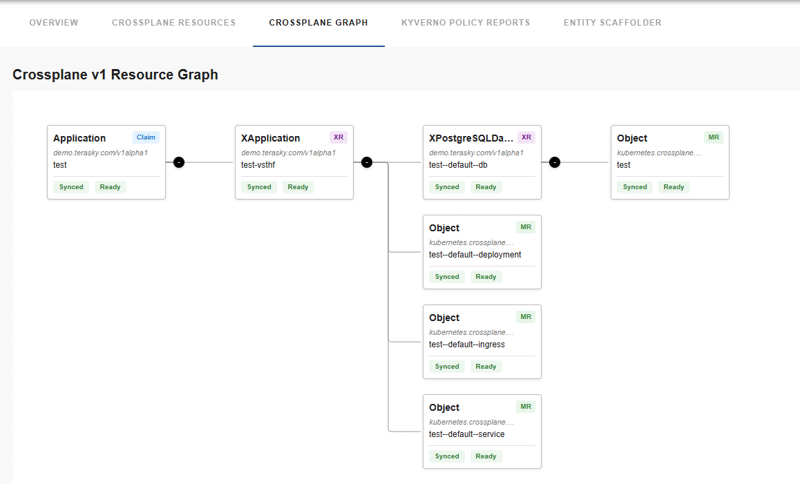
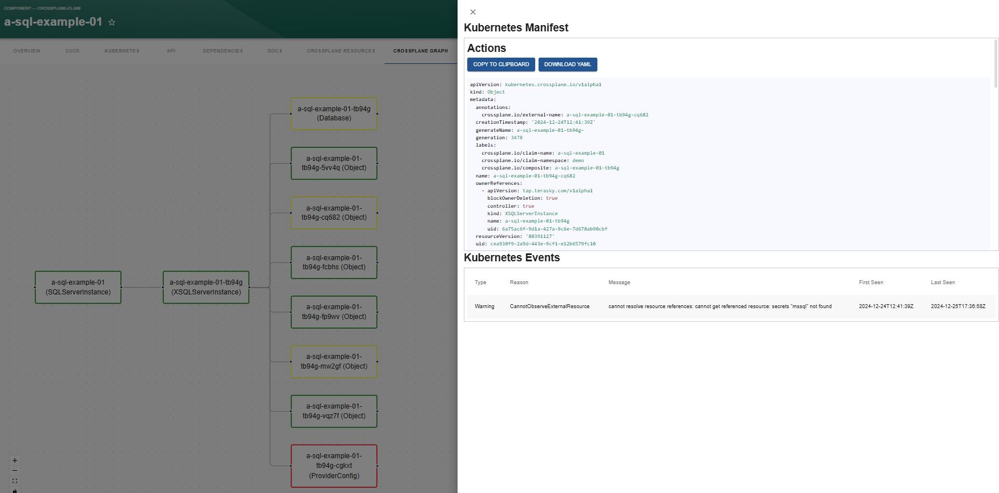
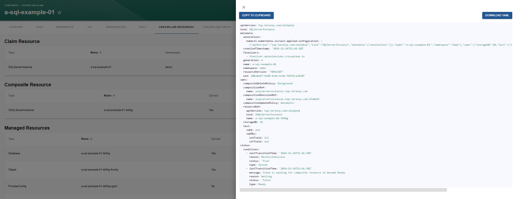
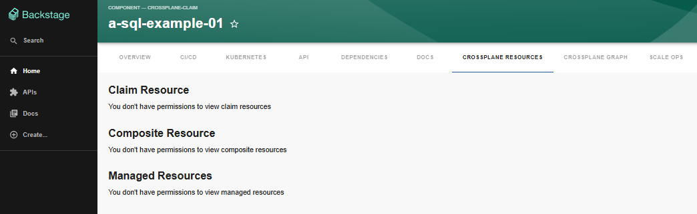
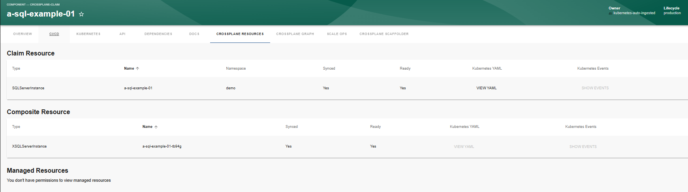

# Crossplane Plugins

The Crossplane plugins for Backstage provide a comprehensive solution for managing and visualizing Crossplane resources within your Backstage instance. These plugins enable teams to effectively monitor and control their cloud resources provisioned through Crossplane.

## Plugin Suite Components

The Crossplane plugin suite consists of several components:

- **Frontend Plugin (`crossplane-resources`)**: Provides visualization and management capabilities for Crossplane resources
- **Backend Plugin (`crossplane-permissions`)**: Handles permission management and access control
- **Common Library (`crossplane-common`)**: Shared utilities and permission definitions

## Key Features

- **Resource Visualization**: View Crossplane claims, composite resources (XRs), and managed resources
- **YAML Management**: Access and manage YAML configurations for all resource types
- **Event Monitoring**: Track events related to your Crossplane resources
- **Resource Graph**: Visual representation of resource relationships
- **Permission Controls**: Granular access control for different resource types and actions
- **Overview Cards**: Quick insights into resource status and relationships

## Screenshots

### Resource Graph View

### Resource Table View

### Permission-Based UI

### Overview Information

## Available Permissions

The plugin suite provides granular permission controls for:

- Crossplane Claims (list, view YAML, show events)
- Composite Resources (list, view YAML, show events)
- Managed Resources (list, view YAML, show events)
- Additional Resources like XRD, Composition, Function (list, view YAML, show events)
- Resource Graph visualization

## Getting Started

To get started with the Crossplane plugins, you'll need to:

1. Install and configure the [Kubernetes Ingestor plugin](../kubernetes-ingestor/overview.md)
2. Set up the permissions backend (optional but recommended)
3. Install the frontend components
4. Configure the plugins according to your needs

For detailed installation and configuration instructions, refer to the individual plugin documentation:

- [Kubernetes Ingestor Plugin Installation](../kubernetes-ingestor/backend/install.md)
- [Kubernetes Ingestor Plugin Configuration](../kubernetes-ingestor/backend/configure.md)
- [Frontend Plugin Installation](./frontend/install.md)
- [Frontend Plugin Configuration](./frontend/configure.md)
- [Backend Plugin Installation](./backend/install.md)
- [Backend Plugin Configuration](./backend/configure.md)
