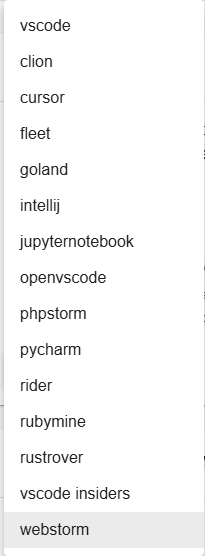

# DevPod Frontend Plugin

## Overview

The DevPod frontend plugin provides a seamless integration between Backstage and DevPod workspaces. It enhances the component overview pages with a dedicated "Open in DevPod" button, enabling developers to quickly launch their preferred development environments.

## Features

### DevPod Integration
- One-click access to DevPod workspaces
- Seamless integration with component overview pages
- Automatic workspace configuration based on component metadata

### IDE Selection
- Support for multiple popular IDEs
- Configurable default IDE preference
- Dynamic IDE selection at runtime

### CLI Command Display
- Shows equivalent CLI commands
- Enables easy copy-paste for terminal users
- Helps with automation and scripting

## Components

### DevpodComponent
The main component that renders the "Open in DevPod" button and handles IDE selection:

- Automatically detects component compatibility
- Manages IDE selection interface
- Handles workspace launch requests

### isDevpodAvailable
A utility function that determines whether DevPod integration should be available for a given entity:

- Checks entity compatibility
- Validates required metadata
- Ensures proper configuration

## Technical Details

### Supported IDEs
The plugin supports a comprehensive list of development environments:

- **Visual Studio Code Family**
    - Visual Studio Code (vscode)
    - VS Code Insiders (vscode-insiders)
    - OpenVSCode (openvscode)

- **JetBrains Suite**
    - IntelliJ IDEA (intellij)
    - PyCharm (pycharm)
    - WebStorm (webstorm)
    - GoLand (goland)
    - CLion (clion)
    - PhpStorm (phpstorm)
    - Rider (rider)
    - RubyMine (rubymine)
    - RustRover (rustrover)
    - Fleet (fleet)

- **Other IDEs**
    - Cursor (cursor)
    - Jupyter Notebook (jupyternotebook)

### Integration Points
- Backstage Catalog
- DevPod CLI
- Local IDE installations

### User Experience
- Intuitive IDE selection interface
- Quick access to development environments

## Screenshots

### DevPod Button Integration

### IDE Selection Interface

