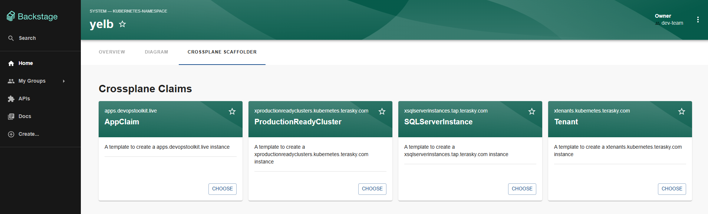

# Entity Scaffolder Content Plugin

The Entity Scaffolder Content plugin for Backstage enables you to embed scaffolder templates directly within entity pages. This powerful feature allows you to contextualize templates based on the entity they're being accessed from, making template discovery and usage more intuitive.

## Features

- **Embedded Template Tab**: Add a dedicated tab for scaffolder templates on entity pages
- **Context-Aware Templates**: Filter and populate templates based on entity context
- **Dynamic Initial Values**: Pre-populate template form fields using entity data
- **Flexible Configuration**: Customize template filtering and data mapping
- **Seamless Integration**: Works with existing scaffolder templates

## Plugin Components

### Frontend Plugin
The plugin provides frontend components for:

- Displaying templates within entity pages
- Filtering templates based on entity context
- Pre-populating template forms with entity data

[Learn more about the frontend plugin](./frontend/about.md)

## Screenshots

*Example of embedded scaffolder templates*

*Template form with pre-populated data*

## Documentation Structure
- [About](./frontend/about.md)
- [Installation](./frontend/install.md)
- [Configuration](./frontend/configure.md)

## Getting Started

To get started with the Entity Scaffolder Content plugin:

1. Install the frontend plugin
2. Configure entity page integration
3. Set up template filters and data mapping
4. Start using contextualized templates

For detailed installation and configuration instructions, refer to the frontend documentation linked above. 