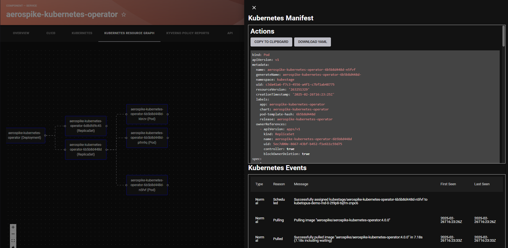
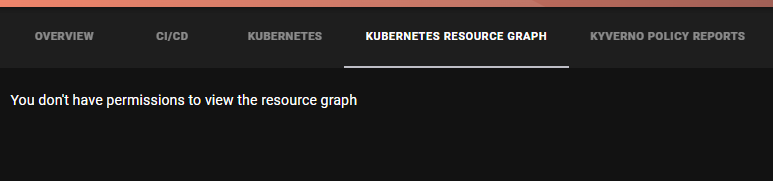

# Kubernetes Resources Plugin

The Kubernetes Resources plugin provides a powerful visualization and management interface for Kubernetes resources within Backstage. It enables users to explore resource relationships, view configurations, and monitor cluster events through an intuitive graphical interface.

## Features

- **Interactive Resource Graph**: Visualize relationships between Kubernetes resources
- **YAML Manifest Viewer**: View and copy resource configurations
- **Event Monitoring**: Track Kubernetes events for specific resources
- **Resource Dependencies**: Map and explore resource relationships
- **Permission Controls**: Fine-grained access control for different resource types
- **Multi-Cluster Support**: View resources across multiple Kubernetes clusters

## Plugin Components

### Frontend Plugin
The plugin provides frontend components for:  
- Resource graph visualization  
- YAML manifest viewing  
- Event monitoring  
- Resource exploration  

[Learn more about the frontend plugin](./frontend/about.md)

### Backend Plugin
The plugin requires a backend deployment that:  
- Aggregates resource data  
- Tracks dependencies  
- Manages permissions  
- Handles cluster communication  

[Learn more about the backend plugin](./backend/about.md)

## Screenshots

*Interactive resource dependency graph*

*Resource events and YAML configuration view*

*Table view of Kubernetes resources*

*Permission-based access control*

## Available Permissions

The plugin supports the following permissions:

- `kubernetes-resources.resources.list`: List and view Kubernetes resources
- `kubernetes-resources.secrets.list`: List and view Secret resources
- `kubernetes-resources.secrets.view-yaml`: View Secret YAML content
- `kubernetes-resources.yaml.view`: View resource YAML content
- `kubernetes-resources.events.show`: View resource events
- `kubernetes-resources.graph.show`: View resource dependency graph

## Documentation Structure

- Frontend Plugin
    - [About](./frontend/about.md)
    - [Installation](./frontend/install.md)
    - [Configuration](./frontend/configure.md)
- Backend Plugin
    - [About](./backend/about.md)
    - [Installation](./backend/install.md)
    - [Configuration](./backend/configure.md)

## Getting Started

To get started with the Kubernetes Resources plugin:

1. Deploy the backend component to your clusters
2. Install the frontend plugin
3. Configure proxy settings
4. Set up entity annotations
5. Configure permissions (optional)

For detailed installation and configuration instructions, refer to the frontend and backend documentation linked above. 