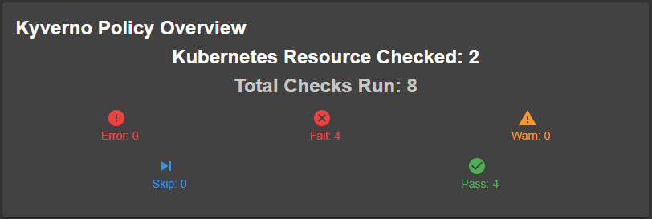

# Kyverno Plugin

The Kyverno plugin for Backstage provides comprehensive integration with Kyverno policy reports, enabling teams to monitor and manage their Kubernetes policy compliance directly within the Backstage interface.

## Plugin Components

### Frontend Plugin (Policy Reports)
The frontend plugin adds visualization capabilities for Kyverno policy reports, allowing users to:  
- View policy reports associated with components  
- Monitor compliance statistics and metrics  
- Access detailed policy information and YAML configurations  
- Track policy results across different clusters  

[Learn more about the frontend plugin](./frontend/about.md)

### Backend Plugin (Permissions)
The backend plugin provides permission management and access control for Kyverno policy reports:  
- Integration with Backstage's permission framework  
- Fine-grained access control for policy reports  
- Secure policy information access  

[Learn more about the backend plugin](./backend/about.md)

## Documentation Structure

- Frontend Plugin
    - [About](./frontend/about.md)
    - [Installation](./frontend/install.md)
    - [Configuration](./frontend/configure.md)
- Backend Plugin
    - [About](./backend/about.md)
    - [Installation](./backend/install.md)
    - [Configuration](./backend/configure.md)

## Screenshots

### Policy Reports Overview

### Detailed Resource View

### Policy YAML View

### Component Overview

